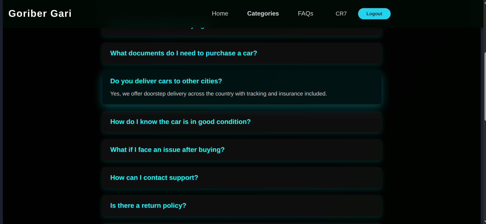
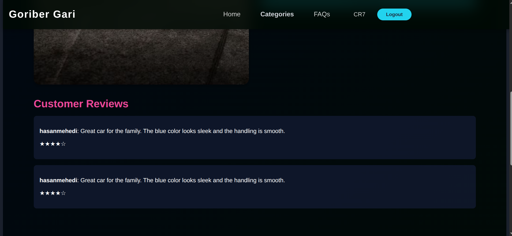

# Goriber Gari - DBMS-1 Project

<p align="center">
  
  <br>
  <strong>An online platform for buying and managing high-quality vehicles.</strong>
</p>

---

## 📖 About The Project

**Goriber Gari** is a full-stack e-commerce platform designed for a seamless car purchasing experience. It allows users to browse a wide catalog of vehicles, view detailed information, and make purchases directly through the website. The project features a modern frontend built with React, a robust backend API powered by FastAPI, and a PostgreSQL database to manage all data efficiently.

The primary goal is to provide a user friendly interface where customers can find their dream car at competitive prices, while also providing administrators with the tools to manage inventory, orders, and user data.

---
## Attachments

  - [Report](attachments/CSE2211_DBMS_Project.pdf)
  - [Video](https://youtu.be/nJaVLU3WCqw?si=9pdGbxrtDZ9v3xI2)
  - [Video with Voice](https://youtu.be/7hatLweTOT8)
  - [Presentation Slide](attachments/DBMS.pptx)

---

## 🏛️ System Architecture

The project follows a classic client-server architecture:

*   **Frontend (Client):** A single-page application (SPA) built with React.js that provides a dynamic and responsive user interface.
*   **Backend (Server):** A RESTful API built with FastAPI that handles business logic, data processing, and communication with the database.
*   **Database:** A PostgreSQL database that stores all application data, including users, cars, orders, and more.
---
<p align="center">
  
</p>

---

## 📁 Folder Structure

```
/home/mehedi/CSE-2211-Project/
├── backend/
│   ├── app/
│   │   ├── models/
│   │   ├── __pycache__/
│   │   ├── admin.py
│   │   ├── database.py
│   │   ├── main.py
│   │   └── queries.py
│   ├── venv/
│   ├── .env
│   ├── database.sql
│   ├── requirements.txt
│   └── run.sh
├── frontend/
│   ├── public/
│   │   ├── images/
│   │   └── social icons/
│   ├── src/
│   │   ├── assets/
│   │   ├── components/
│   │   ├── context/
│   │   └── pages/
│   ├── .gitignore
│   ├── eslint.config.js
│   ├── index.html
│   ├── package-lock.json
│   ├── package.json
│   ├── README.md
│   └── vite.config.js
├── .env
├── .gitignore
├── car-dealer.png
├── car.png
├── CSE2211_DBMS_Project.pdf
├── Queries.txt
├── query_implementation_report.md
├── README.md
└── vercel.json
```

---

## 🛠️ Built With

This project leverages modern technologies for both the frontend and backend development.

**Frontend:**
*   [React.js](https://reactjs.org/) - A JavaScript library for building user interfaces.
*   [Vite](https://vitejs.dev/) - A fast frontend build tool.
*   [React Router](https://reactrouter.com/) - For declarative routing in the React application.
*   [Axios](https://axios-http.com/) - For making HTTP requests to the backend API.
*   [CSS3](https://en.wikipedia.org/wiki/CSS) - For styling the application.

**Backend:**
*   [FastAPI](https://fastapi.tiangolo.com/) - A modern, high-performance web framework for building APIs with Python.
*   [SQLAlchemy](https://www.sqlalchemy.org/) - The Python SQL toolkit and Object Relational Mapper.
*   [Pydantic](https://pydantic-docs.helpmanual.io/) - Data validation and settings management using Python type annotations.
*   [Uvicorn](https://www.uvicorn.org/) - An ASGI server for running the FastAPI application.

**Database:**
*   [PostgreSQL](https://www.postgresql.org/) - A powerful, open-source object-relational database system.

---

## 🚀 Getting Started

To get a local copy up and running, follow these simple steps.

### Prerequisites

Make sure you have the following installed on your machine:
*   [Node.js](https://nodejs.org/en/) (which includes npm)
*   [Python](https://www.python.org/downloads/)
*   [PostgreSQL](https://www.postgresql.org/download/)

### Installation

1.  **Clone the repository:**
    ```sh
    git clone "https://github.com/hasanmehediii/CSE-2211-Project.git"
    cd CSE-2211-Project
    ```

2.  **Setup the Backend:**
    ```bash
    cd backend

    # Create and activate a virtual environment
    python -m venv venv
    venv\Scripts\activate  # On Windows
    # source venv/bin/activate  # On macOS/Linux

    # Install dependencies
    pip install -r requirements.txt

    # Set up your .env file with database credentials
    # Run the database.sql script in your PostgreSQL server to create the tables

    # Start the backend server
    uvicorn app.main:app --reload
    ```

3.  **Setup the Frontend:**
    ```bash
    cd ../frontend

    # Install dependencies
    npm install

    # Start the frontend development server
    npm run dev
    ```
The application should now be running, with the frontend accessible at `http://localhost:5173` and the backend at `http://localhost:8000`.

---

## ✨ Features

*   **User Authentication:** Secure user registration and login functionality.
*   **Product Catalog:** Browse a comprehensive list of available cars with detailed descriptions, specifications, and images.
*   **Detailed Car View:** Get more information on a specific car, including mileage, engine type, and price.
*   **Shopping Cart:** Add and manage cars in a shopping cart before purchase.
*   **Checkout Process:** A streamlined process for purchasing vehicles, including payment and shipping information.
*   **User Profiles:** View and manage personal information and order history.
*   **Inventory Management:** Administrative capabilities to add, update, and remove car listings.

---

## 📸 Screenshots

Here are some screenshots of the application's user interface.

| Page | Screenshot |
|---|---|
| Welcome Page |  |
| Login Page |  |
| Welcome Page 2 |  |
| Admin Home |  |
| Admin Home 2 |  |
| Car Details |  |
| Order |  |
| Payment |  |
| Category |  |
| FAQ |  |
| Manage Car |  |
| Manage User |  |
| Profile |  |
| Profile 2 |  |
| Review |  |

---

## 🗃️ Database Schema

The database is designed to handle all aspects of the e-commerce platform, from users and products to orders and reviews.

**Key Tables:**
*   `users`: Stores user account information.
*   `categories`: Organizes cars into different categories.
*   `cars`: Contains all the details for each vehicle.
*   `employees`: Manages employee data for administrative purposes.
*   `car_inventory` & `car_inventory_log`: Tracks stock levels and inventory history.
*   `purchase`, `orders`, & `order_item`: Manages the entire lifecycle of a customer's order.
*   `shipping`: Handles shipping details and tracking.
*   `reviews`: Allows users to post reviews for purchased cars.

---

## 🌐 API Endpoints

The backend provides a RESTful API to interact with the application data.

**Main Routers:**
*   `/users`: User-related operations.
*   `/cars`: Accessing car data.
*   `/categories`: Managing car categories.
*   `/orders`: Handling customer orders.
*   `/purchase`: Managing purchases.
*   `/reviews`: Creating and viewing product reviews.
*   And more for employees, inventory, and shipping.

---

## 🤝 Contributing

Contributions are what make the open-source community such an amazing place to learn, inspire, and create. Any contributions you make are **greatly appreciated**.

If you have a suggestion that would make this better, please fork the repo and create a pull request. You can also simply open an issue with the tag "enhancement".

1.  Fork the Project
2.  Create your Feature Branch (`git checkout -b feature/AmazingFeature`)
3.  Commit your Changes (`git commit -m 'Add some AmazingFeature'`)
4.  Push to the Branch (`git push origin feature/AmazingFeature`)
5.  Open a Pull Request

---

## 📄 License

Distributed under the MIT License. See `LICENSE` for more information.

---

## 📞 Contact

Project Link: [https://github.com/hasanmehediii/CSE-2211-Project](https://github.com/hasanmehediii/CSE-2211-Project)
